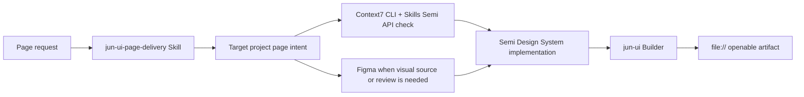

# jun-ui Design System

`jun-ui` is an installable AI page-building Skill, Design System, and Builder. It defines how AI should use Semi Design System, Context7 CLI + Skills, Figma, and `jun-ui build` to create page artifacts Jun can inspect directly inside any target project.

## One-Line Definition

Use the installable Skill and Builder to apply Semi Design System, assisted by Context7 CLI + Skills and Figma, and produce high-quality page artifacts that open through `file://`.

## Design Goal

The goal is not to preserve a specific implementation process. The goal is to make the result fast to produce, visually coherent, interactive, and directly reviewable.

| Need | Design response |
| --- | --- |
| Fast AI page creation | Reuse Semi components and project templates instead of inventing UI from scratch. |
| Correct component usage | Use Context7 CLI + Skills and `ctx7` to check Semi APIs and examples before material implementation choices. |
| Visual alignment | Use Figma when design intent, review, or reusable design assets matter. |
| Direct review | Use `jun-ui build` to create a `file://` openable artifact with relative assets. |
| Repeatability | Keep prompts, templates, build profiles, and validation rules in this repository. |

## System Layers

## Roles

| Part | Responsibility |
| --- | --- |
| Semi Design System | Product UI components, interaction primitives, and page-level composition building blocks. |
| Context7 CLI + Skills | Required documentation retrieval mode; `ctx7` grounds AI before using Semi components. |
| Figma | Visual source, review surface, and design-system bridge when a page needs shared design intent. |
| Builder | Converts page intent into Vite-bundled Semi artifacts with classic IIFE JavaScript, CSS, relative assets, and static fallback. |
| Skill | Installable entrypoint that makes AI choose the right path, use the selected tools correctly, and verify the result. |
| Validation | Prevents stale instructions and checks the current delivery contract remains explicit. |

## Page Types

The system should support:

- dashboards and operational consoles;
- settings and configuration screens;
- detail pages with metadata, history, and actions;
- forms and multi-step workflows;
- local tools and workbenches;
- AI-generated prototypes that need product-grade UI.

## Delivery Contract

A page is acceptable only when the final artifact:

- opens through `file://`;
- loads styles and scripts through relative paths;
- shows the actual page experience immediately;
- preserves key interactions without a dev server;
- has no visible broken asset paths;
- can be handed to a reviewer as a folder or single-file artifact.

## Implementation Direction

Default to Semi Design System for UI implementation. Use Context7 CLI + Skills before writing or changing substantial Semi code. MCP is optional. Stop before Semi implementation if no approved Context7 path is available. Use Figma when visual intent is part of the task. Allow compilation whenever it improves speed, quality, or component coverage, as long as the built result satisfies the delivery contract.

Use the Builder as the default execution surface. A target project should provide page intent, data, and output path; `jun-ui` should provide the installable Skill, Builder, Design System rules, and artifact verification. The Builder may use React, Vite, and Semi internally, but target projects should receive only the built `file://` artifact folder unless the user explicitly chooses a project-owned build setup.

## Non-Goals

- Building a parallel UI component library.
- Maintaining target project business adapters.
- Treating source-level implementation purity as the main value.
- Requiring a dev server to review the final page.
- Letting AI rely on guessed component APIs when documentation can be checked.
