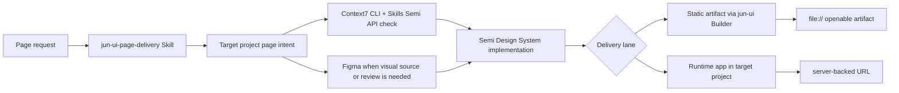

# jun-ui Design System

`jun-ui` is an installable AI page-building Skill, Design System, and Builder. It defines how AI should use Semi Design System, Context7 CLI + Skills, Figma, `jun-ui build`, and a runtime UI contract to create product UI Jun can inspect directly inside any target project.

## One-Line Definition

Use the installable Skill to choose the right delivery lane, apply Semi Design System with Context7 CLI + Skills and Figma when needed, and produce either a high-quality `file://` artifact or a server-backed runtime app UI.

## Design Goal

The goal is not to preserve a specific implementation process. The goal is to make the result fast to produce, visually coherent, interactive, and directly reviewable.

| Need | Design response |
| --- | --- |
| Fast AI page creation | Reuse Semi components and project templates instead of inventing UI from scratch. |
| Correct component usage | Use Context7 CLI + Skills and `ctx7` to check Semi APIs and examples before material implementation choices. |
| Visual alignment | Use Figma when design intent, review, or reusable design assets matter. |
| Direct review | Use `jun-ui build` for `file://` artifacts, or verify the target project's runtime URL when server state is required. |
| Repeatability | Keep prompts, templates, build profiles, and validation rules in this repository. |

## System Layers

## Roles

| Part | Responsibility |
| --- | --- |
| Semi Design System | Product UI components, interaction primitives, and page-level composition building blocks. |
| Context7 CLI + Skills | Required documentation retrieval mode; `ctx7` grounds AI before using Semi components. |
| Figma | Visual source, review surface, and design-system bridge when a page needs shared design intent. |
| Builder | Converts page intent into Vite-bundled Semi artifacts with classic IIFE JavaScript, CSS, relative assets, and static fallback. |
| Runtime UI contract | Applies the same Design System to target-project-owned server-backed apps. |
| Skill | Installable entrypoint that makes AI choose the right path, use the selected tools correctly, and verify the result. |
| Validation | Prevents stale instructions and checks the current delivery contract remains explicit. |

## Page Types

The system should support:

- dashboards and operational consoles;
- settings and configuration screens;
- detail pages with metadata, history, and actions;
- forms and multi-step workflows;
- local tools and workbenches;
- AI-generated prototypes that need product-grade UI.

## Delivery Lanes

Use `docs/delivery-lanes.md` as the source of truth for lane selection.

| Lane | Contract |
| --- | --- |
| Static artifact | The final artifact opens through `file://`, uses relative assets, and passes strict verification. |
| Runtime app | The target project owns server runtime, data, auth, routes, and deployment while reusing `jun-ui` tokens and Semi patterns. |

The agent should infer the lane from the request. It should ask the user only when runtime server reads or writes are unclear and choosing the wrong lane would cause material rework.

## Static Artifact Contract

A page is acceptable only when the final artifact:

- opens through `file://`;
- loads styles and scripts through relative paths;
- shows the actual page experience immediately;
- preserves key interactions without a dev server;
- has no visible broken asset paths;
- can be handed to a reviewer as a folder or single-file artifact.

## Runtime App Contract

A runtime app surface is acceptable only when:

- it uses Semi Design System and `--jun-ui-*` tokens for product UI;
- it uses Context7 CLI + Skills before material Semi API decisions;
- the target project owns backend routes, API behavior, auth, data, and deployment;
- the UI exposes loading, empty, error, and saved states when server state is involved;
- verification checks the served URL and at least one relevant server-backed behavior.

## Implementation Direction

Default to Semi Design System for UI implementation. Use Context7 CLI + Skills before writing or changing substantial Semi code. MCP is optional. Stop before Semi implementation if no approved Context7 path is available. Use Figma when visual intent is part of the task. Allow compilation whenever it improves speed, quality, or component coverage, as long as the built result satisfies the delivery contract.

Use the Builder as the default execution surface for static artifacts. A target project should provide page intent, data, and output path; `jun-ui` should provide the installable Skill, Builder, Design System rules, and artifact verification. The Builder may use React, Vite, and Semi internally, but target projects should receive only the built `file://` artifact folder unless the user explicitly chooses a project-owned build setup or the request requires the runtime app lane.

Use the target project's existing app stack for runtime apps. `jun-ui` should not take over server ownership; it should make the UI look and behave like part of the same Design System.

## Interaction Affordance Hierarchy

A page must use one consistent visual language for "what is clickable." Each interaction's tier decides its appearance; never represent one tier two different ways, never let passive status look like an action, and never let two primaries compete in the same view.

| Tier | Semi treatment | Rule |
| --- | --- | --- |
| Primary | `Button theme="solid" type="primary"` | at most one per view/section |
| Secondary (nav, utilities, filters) | `Button type="tertiary"` / `theme="light"` | uniform size within a zone |
| Inline shortcut (jump / "see all") | `Button theme="borderless" size="small"` | link-like, still a real control |
| Openable object (cards, rows) | card/row with hover state | not button-shaped |
| Passive status (counts, labels) | `Tag` / small muted text | must not look clickable |

Express semantic states (warn/success/danger/lock) through Semi props, not bare CSS colors, because jun-ui exposes a single accent token and strict verification rejects bare page colors. The actionable contract, anti-patterns, and a pre-delivery checklist live in `skills/jun-ui-page-delivery/references/affordance-hierarchy.md`.

## Non-Goals

- Building a parallel UI component library.
- Maintaining target project business adapters.
- Treating source-level implementation purity as the main value.
- Requiring a dev server to review static artifacts.
- Hiding runtime requirements inside a static artifact when the UI needs server state.
- Letting AI rely on guessed component APIs when documentation can be checked.
