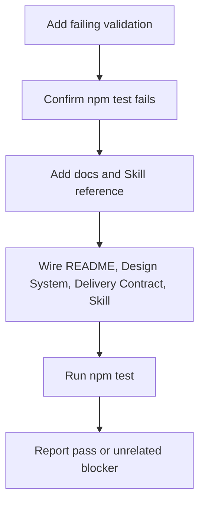

# Information Hierarchy Implementation Plan

> **For agentic workers:** REQUIRED SUB-SKILL: Use superpowers:subagent-driven-development (recommended) or superpowers:executing-plans to implement this plan task-by-task. Steps use checkbox (`- [ ]`) syntax for tracking.

**Goal:** Add an information architecture and visual hierarchy doctrine to `jun-ui` so future AI-generated pages weight primary information, secondary information, tertiary information, and actions correctly before composing UI.

**Architecture:** Keep the new knowledge in docs and Skill references, then enforce wiring through `scripts/validate.mjs`. Do not create a new component framework; Semi Design System, Context7, Figma, Builder, static artifact, and runtime app lanes remain the delivery foundation.

**Tech Stack:** Markdown docs, `jun-ui-design-system` Skill references, Node validation script, `npm test`.

---

## Reader Summary

This plan turns page-design learning into a durable repository rule. The important move is not a new visual style; it is a required pre-composition packet that makes agents identify the page job, primary information, secondary information, tertiary information, and primary action before layout.

## Execution Recommendation

Use inline execution for this small docs-and-validation task. Use subagents only if template/example redesigns are added later.

## What This Changes

| Area | Change |
| --- | --- |
| Docs | Add canonical information architecture doctrine. |
| Skill | Add fast checklist and reference link. |
| Delivery contract | Treat visual weight mismatch as a page-quality failure. |
| Validation | Require the new docs and Skill wiring. |

## Execution Flow



### Task 1: Add Validation Red Test

**Files:**
- Modify: `/Users/jun/workspace/jun-ui/scripts/validate.mjs`

- [ ] **Step 1: Require new docs and reference files**

Add these paths to `requiredFiles`:

```js
"docs/page-information-architecture.md",
"docs/prompts/2026-06-13-information-hierarchy-long-task.md",
"docs/superpowers/plans/2026-06-13-information-hierarchy-implementation.md",
"docs/superpowers/specs/2026-06-13-information-hierarchy-design.md",
"skills/jun-ui-design-system/references/information-architecture.md",
```

- [ ] **Step 2: Require user-facing terms**

Add the canonical doc and reference to `userFacingFiles`, then add these combined terms:

```js
"information architecture",
"visual hierarchy",
"primary information",
"secondary information",
```

- [ ] **Step 3: Require Skill wiring**

Add this check:

```js
if (!skill.includes("information-architecture.md") || !skill.includes("visual hierarchy")) {
  errors.push("design system skill must require information architecture and visual hierarchy review");
}
```

- [ ] **Step 4: Run the red test**

Run:

```bash
npm test
```

Expected: failure that names the missing docs and missing Skill wiring.

### Task 2: Add Canonical Doctrine

**Files:**
- Create: `/Users/jun/workspace/jun-ui/docs/page-information-architecture.md`

- [ ] **Step 1: Write the source-backed doctrine**

Include sections for:

```text
One-Line Rule
Source Model
Information Weight Tiers
Page Design Workflow
Layout Rules
Typography Rules
First-Screen Tests
Anti-Patterns
Relationship To Existing Rules
```

- [ ] **Step 2: Include required repository terms**

The document must include:

```text
Semi Design System
Context7
Figma
file://
file-openable
installable
Builder
information architecture
visual hierarchy
primary information
secondary information
```

### Task 3: Add Skill Reference

**Files:**
- Create: `/Users/jun/workspace/jun-ui/skills/jun-ui-design-system/references/information-architecture.md`

- [ ] **Step 1: Add the pre-composition packet**

Include a table with:

```text
Page job
Primary information
Secondary information
Tertiary information
Primary action
Risk if missed
```

- [ ] **Step 2: Add mandatory checks and reject rules**

Require first-screen clarity, heading outline, value-to-area balance, action proximity, mobile stacking, static artifact verification, and runtime app verification.

### Task 4: Wire User-Facing Docs And Skill

**Files:**
- Modify: `/Users/jun/workspace/jun-ui/README.md`
- Modify: `/Users/jun/workspace/jun-ui/docs/design-system.md`
- Modify: `/Users/jun/workspace/jun-ui/docs/problem-and-solution.md`
- Modify: `/Users/jun/workspace/jun-ui/skills/jun-ui-design-system/SKILL.md`
- Modify: `/Users/jun/workspace/jun-ui/skills/jun-ui-design-system/references/delivery-contract.md`

- [ ] **Step 1: Add docs index link**

Add `docs/page-information-architecture.md` to the README documents list.

- [ ] **Step 2: Add design-system layer**

Document that information architecture decides what matters, visual hierarchy maps it to weight, and affordance hierarchy maps controls to interaction tiers.

- [ ] **Step 3: Add Skill workflow step**

Require agents to classify primary information and secondary information before choosing layout and Semi components.

- [ ] **Step 4: Add delivery-contract quality gate**

State that static and runtime pages fail review when visual weight contradicts information value.

### Task 5: Verify

**Files:**
- Read: `/Users/jun/workspace/jun-ui/scripts/validate.mjs`

- [ ] **Step 1: Run full validation**

Run:

```bash
npm test
```

Expected: `jun-ui validation passed`.

- [ ] **Step 2: If validation fails from unrelated branch drift**

Report exact failures and identify whether they are outside the information hierarchy change.
