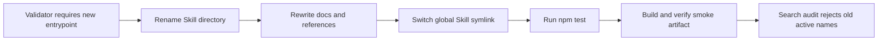

# jun-ui Design System Skill Rename Implementation Plan

> **For agentic workers:** REQUIRED SUB-SKILL: Use superpowers:subagent-driven-development (recommended) or superpowers:executing-plans to implement this plan task-by-task. Steps use checkbox (`- [ ]`) syntax for tracking.

**Goal:** Hard-cut the installable AI entrypoint from the former Skill name to `jun-ui-design-system`.

**Architecture:** The Skill remains the single AI entrypoint for static artifact and runtime app lanes, but its public name changes to `jun-ui-design-system`. Repository validation becomes the enforcement layer: the new Skill path and frontmatter are required, and old active entrypoints are rejected.

**Tech Stack:** Markdown Skill files, repository docs, Node validation script, global Codex Skill symlink, `npm test`, `jun-ui build`, and `jun-ui verify-page`.

---

## Reader Summary

This is a hard cut, not a compatibility migration. The final repository and global install should expose only `jun-ui-design-system` as the active Jun UI Skill entrypoint.

## Execution Recommendation

Use inline execution in the current checkout because the user explicitly requested a one-shot hard cut and the current worktree is clean.

## What This Changes

| Surface | Change |
| --- | --- |
| Skill path | Rename the former Skill directory to `skills/jun-ui-design-system`. |
| Skill name | Change frontmatter to `name: jun-ui-design-system`. |
| Docs | Rewrite active docs, prompts, and references to point at the new entrypoint. |
| Validation | Require the new entrypoint and reject former entrypoints as active entries. |
| Global install | Point `/Users/jun/.codex/skills/jun-ui-design-system` at the repo Skill and remove the old global Skill symlink. |

## Execution Flow

## Main Risks

| Risk | Impact | Guard |
| --- | --- | --- |
| Old Skill remains visible | AI may follow the wrong entrypoint | Validator rejects old active global and repo paths. |
| Docs mix names | AI may infer compatibility | Search audit and required docs checks. |
| Over-replacing history | Old plan/spec history loses context | Keep historical docs readable, but ensure active guidance names only the new entrypoint. |

### Task 1: Make Validation Require The New Entry

**Files:**
- Modify: `scripts/validate.mjs`

- [ ] **Step 1: Update required Skill paths**

Replace former Skill paths with `skills/jun-ui-design-system/...`.

- [ ] **Step 2: Reject old active entrypoints**

Add former entrypoint paths to removed-file checks and global Skill checks.

- [ ] **Step 3: Run red test**

Run: `npm test`

Expected: FAIL because `skills/jun-ui-design-system/SKILL.md` and the global installed Skill do not exist yet.

### Task 2: Rename The Skill

**Files:**
- Move: the former Skill directory to `skills/jun-ui-design-system`
- Modify: `skills/jun-ui-design-system/SKILL.md`
- Modify: `skills/jun-ui-design-system/references/*.md`

- [ ] **Step 1: Rename the directory**

Move the full Skill directory to the new name.

- [ ] **Step 2: Update frontmatter and headings**

Change the Skill frontmatter to `name: jun-ui-design-system` and make the heading describe the Design System entrypoint.

- [ ] **Step 3: Update internal Skill references**

Rewrite references so the Skill is described as the AI entrypoint for the Jun UI Design System, not only a delivery workflow.

### Task 3: Rewrite Active Documentation

**Files:**
- Modify: `README.md`
- Modify: `AGENTS.md`
- Modify: `docs/builder.md`
- Modify: `docs/delivery-lanes.md`
- Modify: `docs/design-system.md`
- Modify: `docs/page-information-architecture.md`
- Modify: `docs/problem-and-solution.md`
- Modify: `docs/prompts/*.md`
- Modify: `docs/superpowers/plans/*.md`
- Modify: `docs/superpowers/specs/*.md`

- [ ] **Step 1: Replace active entrypoint references**

Rewrite former entrypoint references to `jun-ui-design-system` where the text points to the current Skill entrypoint.

- [ ] **Step 2: Preserve historical meaning where useful**

Historical plan/spec files may mention the old name only as prior context, but active guidance must use the new name.

### Task 4: Switch Global Install

**Files:**
- Remove: the former global Skill symlink
- Create symlink: `/Users/jun/.codex/skills/jun-ui-design-system` -> `/Users/jun/workspace/jun-ui/skills/jun-ui-design-system`

- [ ] **Step 1: Remove old global Skill symlink**

Remove the former global Skill symlink.

- [ ] **Step 2: Create new global Skill symlink**

Create `/Users/jun/.codex/skills/jun-ui-design-system`.

### Task 5: Verify The Hard Cut

**Files:**
- Verify: all changed files

- [ ] **Step 1: Run repository tests**

Run: `npm test`

Expected: PASS.

- [ ] **Step 2: Build smoke artifact**

Run: `node scripts/jun-ui.mjs build templates/workbench/jun-ui.page.json --out /tmp/jun-ui-design-system-smoke`

Expected: exit 0 and artifact written.

- [ ] **Step 3: Verify smoke artifact**

Run: `node scripts/jun-ui.mjs verify-page templates/workbench/jun-ui.page.json --strict`

Expected: PASS.

- [ ] **Step 4: Search audit**

Run: `rg -n "former-entrypoint|static-entrypoint" README.md AGENTS.md docs skills scripts package.json /Users/jun/.codex/skills`

Expected: no active entrypoint references; any historical references must be intentional and not in active guidance.
