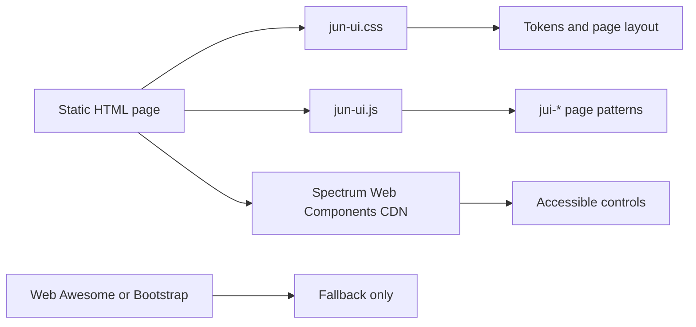

# jun-ui Design Spec

## Readable Summary

`jun-ui` is the new default carrier for no-build static product pages: use it first, let Spectrum provide the low-level controls, and keep Web Awesome or Bootstrap as explicit fallbacks.

## Recommended Approach

Create a small public repository at `/Users/jun/workspace/jun-ui` with three durable surfaces:

- `jun-ui.css` for tokens, layout primitives, page density, panel styling, and state rules.
- `jun-ui.js` for a few light DOM custom elements that turn common page patterns into stable tags.
- `examples/` for directly openable static HTML templates that future AI sessions can copy.

## Visual Overview

## Key Risks

| Risk | Impact | Mitigation |
| --- | --- | --- |
| Spectrum CDN changes | Examples may shift visually | Keep `jun-ui` wrapper small and fallback-friendly |
| Overbuilding custom elements | Library becomes another framework | Only add repeated page patterns |
| Generic Bootstrap look | Pages lose product specificity | Bootstrap remains fallback only |

## Scope

In scope:

- No-build static usage.
- Product-tool pages such as dashboard, form, and detail pages.
- A public GitHub repository.
- A global memory update that makes `jun-ui` the default entrypoint.

Out of scope:

- npm publishing.
- React/Vite/Tailwind integration.
- A full replacement for Spectrum, Web Awesome, or Bootstrap.

## Architecture

`jun-ui` wraps, but does not fork, an external component system. The first adapter is Spectrum Web Components because it has a mature design system, theme element, and design-token model. `jun-ui` owns the page-level vocabulary: shell, page header, panel, stack, grid, section title, stats, and empty state.

The custom elements use light DOM so page-level CSS can keep control of layout. They only hydrate small attribute-driven content and preserve normal HTML readability.

## Components

| Element | Purpose |
| --- | --- |
| `<jui-app-shell>` | Main page container |
| `<jui-page-header>` | Title, subheading, and action row |
| `<jui-panel>` | Framed content surface |
| `<jui-section-title>` | Section heading and helper text |
| `<jui-stat>` | Compact metric display |
| `<jui-empty-state>` | Empty or resolved state |

## Validation

The first validation layer is `npm test`, which checks required files, tokens, custom element registration, examples, and JS syntax. The second validation layer is Chrome headless rendering of the examples through a local static server.
