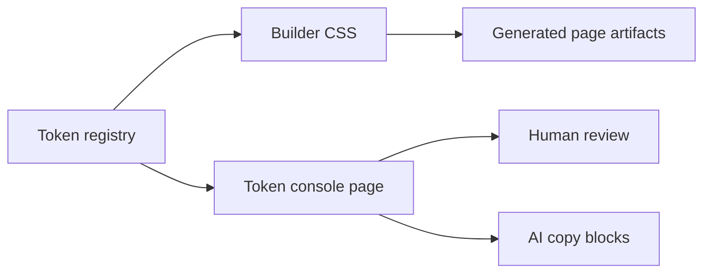
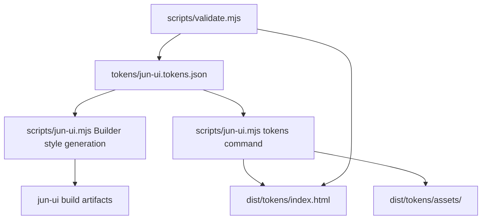

# Token Console Design

## Readable Summary

### Summary

Build a mixed-audience token console for `jun-ui`: human reviewers can inspect the visual system, and AI agents can copy stable token names, values, and usage rules when generating pages.

### Recommended Approach

Create a shared token registry as the source of truth, then generate both Builder CSS and a file-openable token console artifact from that registry. The first version should stay focused on tokens and page-pattern proof, not a full component gallery.

### Visual Overview

### Key Risks

| Risk | Impact | Mitigation |
| --- | --- | --- |
| Token drift | Console disagrees with Builder output | Use one registry for both outputs |
| Gallery scope creep | Becomes Semi documentation | Limit first version to tokens plus page-pattern proof |
| Weak AI utility | Agents still guess values | Include copy blocks with names, values, and usage notes |

## Goal

Add a design-system token page that makes `jun-ui` tokens visible, inspectable, and reusable. The page should help a human judge the design system quickly while giving AI agents a stable reference for future page generation.

## Scope

The first version includes:

- a token registry that lists `jun-ui` token names, values, roles, and usage guidance;
- token groups for color, type, spacing, radius, border, and shadow;
- a file-openable token console artifact generated by a repository-owned `jun-ui tokens` command;
- visual swatches and examples for each token group;
- a compact page-pattern proof using the same tokens: header, panel, metric cards, table-like rows, and action area;
- copy-friendly token blocks for AI use;
- validation that checks registry presence, required token groups, and the generated artifact shape.

## Non-Goals

- Do not build a parallel component framework.
- Do not create a full Semi component documentation site.
- Do not require a dev server for final review.
- Do not add Context7, Figma, or token tooling to browser runtime output.
- Do not move target-project page data into this repository.

## Audience

| Audience | Need | Page response |
| --- | --- | --- |
| Human reviewer | See the system's visual feel | Swatches, type samples, spacing scale, pattern proof |
| AI agent | Reuse exact tokens | Copy blocks with CSS variables, values, roles, and guidance |
| Maintainer | Prevent drift | Shared registry and validation |

## User Experience

The first screen should show the token console title, the current design-system identity, and a compact health summary: token group count, source registry, and file-openable status. It should avoid marketing copy and behave like a product-tool reference surface.

The main page should be organized as dense sections:

1. Color tokens: swatches, variable names, hex values, roles, and contrast-oriented usage notes.
2. Type tokens: font stack, heading/body/helper samples, line-height notes, and usage guidance.
3. Spacing tokens: page padding, section gap, card gap, and control density examples.
4. Shape tokens: radius, border, and shadow examples.
5. Pattern proof: a realistic mini workbench rendered only with registry tokens.
6. AI copy block: grouped CSS custom properties and concise usage notes.

## Architecture

The design should introduce one stable token registry and use it as the shared input for token display and Builder CSS.

The implementation should add a `jun-ui tokens` command to `scripts/jun-ui.mjs`. The exact internal helper names can be adjusted during implementation, but the source-of-truth rule should not change: token values must not be duplicated manually between Builder styles and the token console.

## Token Registry Shape

Use structured data instead of parsing CSS. A registry entry should include:

| Field | Purpose |
| --- | --- |
| `name` | CSS custom property, such as `--jun-ui-bg` |
| `value` | Raw token value |
| `group` | Color, type, spacing, radius, border, or shadow |
| `role` | Human-readable design role |
| `usage` | Short rule for humans and AI agents |
| `example` | Optional display hint for the console |

The registry should start from the tokens already used in Builder output:

- `--jun-ui-bg`
- `--jun-ui-panel`
- `--jun-ui-ink`
- `--jun-ui-muted`
- `--jun-ui-line`
- `--jun-ui-accent`
- `--jun-ui-radius`
- `--jun-ui-shadow`

The implementation should also promote current hard-coded Builder values for typography and spacing into named registry tokens when those values are shown in the console. New semantic tokens should be added only when they are used by both the token console and Builder output.

## Error Handling

Validation should fail when:

- the registry file is missing;
- a required token group is empty;
- a required Builder token is absent from the registry;
- the generated token console has absolute asset paths;
- the generated token console is missing static fallback content.

The console should still render static content before JavaScript runs, matching the existing Builder artifact contract.

## Testing And Verification

Before calling the work ready:

1. Run `npm test`.
2. Generate the token console artifact with `jun-ui tokens`.
3. Open or inspect the built artifact through `file://` or a browser-equivalent smoke check.
4. Confirm the page is nonblank.
5. Confirm styles load from relative assets.
6. Confirm copy blocks and basic controls work without a dev server.

## Acceptance Criteria

- A reviewer can open the token console artifact directly through `file://`.
- The page displays all required token groups and the current Builder tokens.
- The page includes visual examples and AI copy blocks.
- Builder CSS and the token console use the same token registry.
- Validation catches missing required tokens and artifact-shape regressions.
- Existing page build behavior remains compatible with current Builder outputs.
