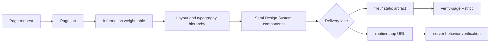

# Information Hierarchy Design

## Readable Summary

### Summary

`jun-ui` needs an explicit information architecture layer so AI page builders decide what matters before choosing components, cards, typography, and layout.

### Recommended Approach

Add a source-backed page hierarchy doctrine, a fast Skill checklist, and validation checks that keep the doctrine wired into user-facing docs and `jun-ui-page-delivery`.

### Visual Overview

### Key Risks

| Risk | Impact | Control |
| --- | --- | --- |
| Rules stay as passive advice | Future pages keep drifting | Add Skill reference and validation checks |
| Guidance becomes generic design theory | Agents cannot execute it | Convert sources into checklists and reject rules |
| Token or artifact work gets mixed in | Scope expands unpredictably | Keep this change at IA, Skill, docs, and validation wiring |

## Problem

AI-generated pages often fail even when they use acceptable components. The common failure is mismatched information weight: low-value metadata, decoration, instructions, or debug detail becomes visually large, while high-value conclusions, state, and actions are small, late, or detached.

`jun-ui` exists to help agents build high-quality pages quickly in other projects. That requires more than a component system. It needs a stable page-design knowledge base that tells agents how to structure information before composing UI.

## Goals

- Define primary information, secondary information, tertiary information, and supporting chrome.
- Require a page job and weight table before composition.
- Map information weight to first-screen placement, area, type scale, grouping, and action proximity.
- Add source-backed rules from NN/g, W3C WAI, Carbon, GOV.UK, Don Norman, and information architecture practice.
- Keep Semi Design System, Context7, Figma, Builder, static artifact, and runtime app responsibilities unchanged.
- Add validation so the new doctrine remains wired into the Skill and docs.

## Non-Goals

- Do not create a parallel component framework.
- Do not redesign every existing example in this task.
- Do not change Semi component APIs.
- Do not turn visual review into a required Figma step for every small page.
- Do not replace `verify-page --strict` with subjective review.

## Design

Create `docs/page-information-architecture.md` as the canonical doctrine. It explains the source model, weight tiers, layout rules, typography rules, first-screen tests, anti-patterns, and relationship to existing affordance and delivery rules.

Create `skills/jun-ui-page-delivery/references/information-architecture.md` as the fast execution reference. It contains the required pre-composition packet, weight-to-UI mapping, mandatory checks, reject rules, and a compact review prompt.

Update the main Skill and user-facing docs so agents read and apply the new reference before composing page layout. The Skill should classify page job, primary information, secondary information, tertiary information, and primary action before Semi implementation.

Update `scripts/validate.mjs` so `npm test` fails if the new docs or Skill reference disappear, or if the Skill no longer mentions information architecture and visual hierarchy.

## Testing

Use TDD for validation wiring:

1. Add validation requirements for the new docs and Skill reference.
2. Run `npm test` and observe failure from missing docs and missing Skill wiring.
3. Add docs and Skill changes.
4. Run `npm test` again.

If unrelated branch drift prevents full green, report the exact failures separately and do not hide them.

